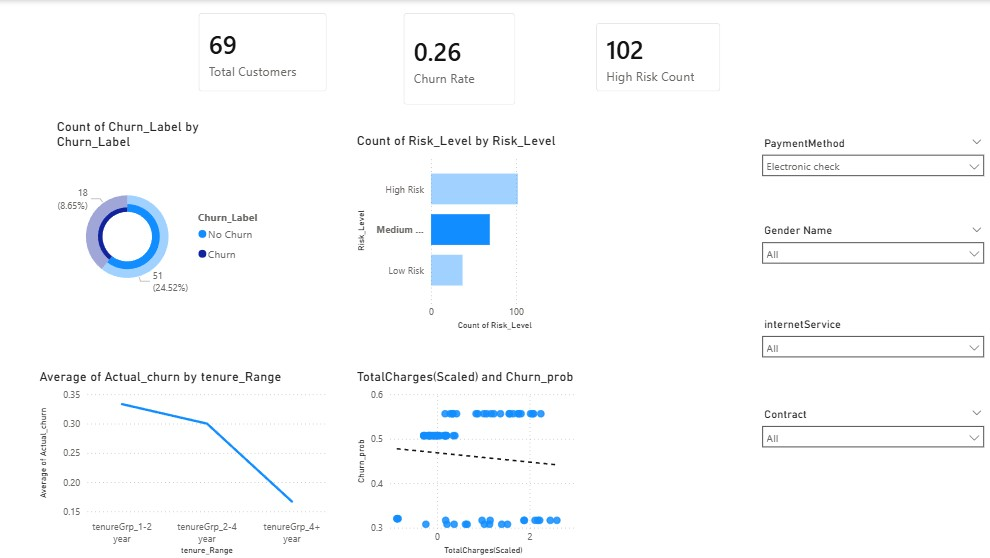

# Overview
This project predicts customer churn using machine learning models and presents insights through an interactive Power BI dashboard.

# Objective
- Identify customers likely to churn  
- Segment customers into risk categories  
- Help businesses improve retention strategies
   
# Tech Stack
- Python (Pandas, NumPy, Scikit-learn)
- Machine Learning (Logistic Regression, Decision Tree, XGBoost)
- Power BI (Dashboard Visualization)
  
# Workflow
1. Data Cleaning & Preprocessing  
2. Feature Engineering  
3. Handling Class Imbalance (SMOTE)  
4. Model Training & Comparison  
5. ROC-AUC Evaluation  
6. Threshold Tuning  
7. Dashboard Creation in Power BI
   
# Dashboard Preview

# Project Structure
customer_churn_prediction/
data/
notebook/
dashboard/
model/
image/
README.md

# Insights
- Customers with low tenure are more likely to churn  
- Certain payment methods show higher churn rates  
- Risk segmentation helps target high-risk customers  

#Business Impact
This project helps organizations:
- Reduce customer churn  
- Improve retention strategies  
- Make data-driven decisions 
